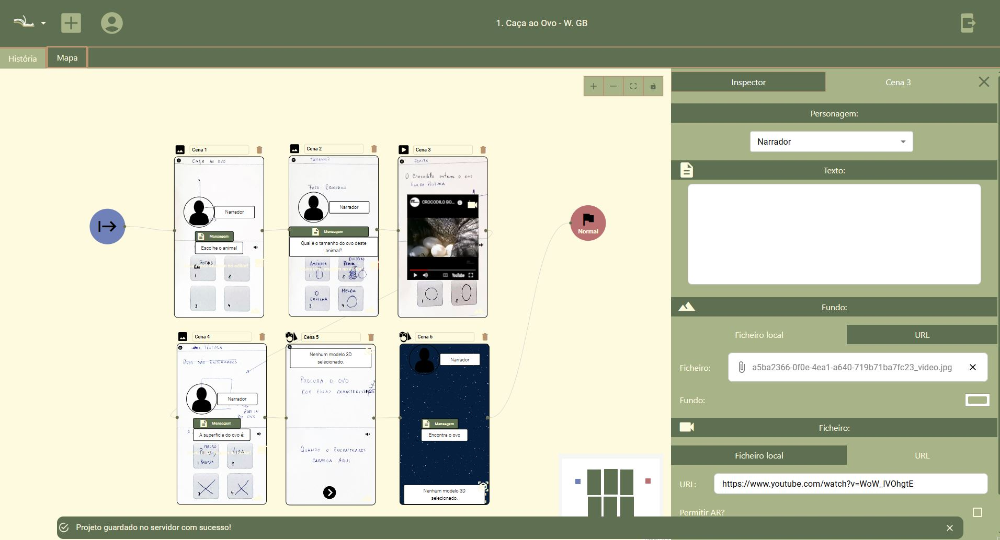
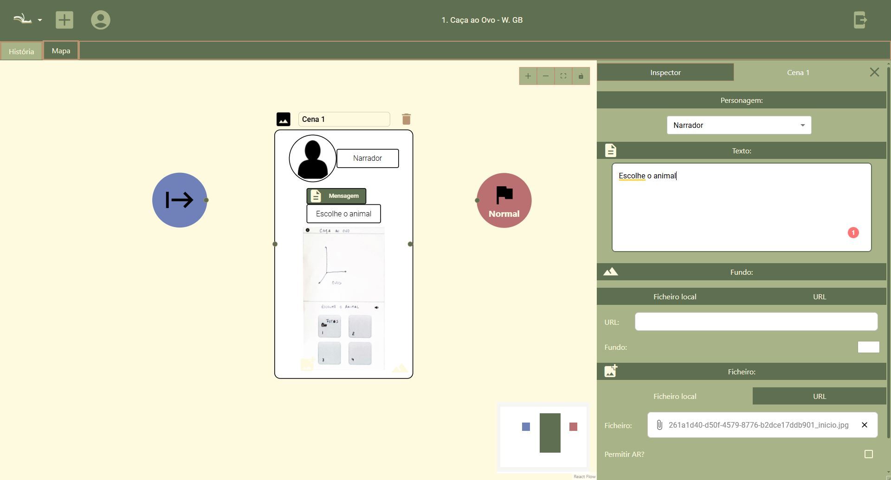
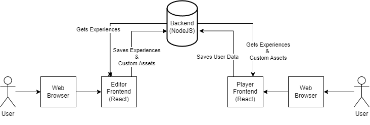

# StoryWeaver AR

An augmented reality storytelling platform developed as my MSc dissertation project at FEUP.

The platform enables museum curators and cultural heritage professionals to create interactive location-based AR experiences through a visual story editor, while visitors consume those experiences through a dedicated mobile-oriented player application.

The system is composed of:

- an **Editor** application for creating interactive narratives
- a **Player** application for consuming AR-enhanced experiences
- a **Node.js backend** for persistence, authentication and media management

📄 **Master's Thesis Document:**  
[Read the dissertation PDF](./dissertation.pdf)

## Screenshots / Demo


_Editing a story with the Flowchart_


_Another Flowchart example_

---

# Overview

StoryWeaver AR was designed to explore how non-technical users can author interactive cultural heritage experiences using visual storytelling tools and web-based augmented reality technologies.

The project combines:

- visual node-based editing
- multimedia storytelling
- geolocation systems
- browser-based augmented reality
- interactive narrative structures

---

# Architecture



## Editor Application

A React-based visual editor used to create interactive experiences through a flowchart-style interface powered by React Flow.

Curators can:

- create branching narratives
- connect story moments visually
- associate media and AR content with locations
- define museum maps and story paths

### Supported Story Nodes

- Dialogue nodes
- 3D model nodes
- Audio nodes
- Video nodes
- Image nodes
- Quiz nodes
- Path/navigation nodes

Each node can optionally support augmented reality presentation modes.

---

## Player Application

A React-based player application targeted at museum visitors.

The player:

- tracks the user’s physical location
- triggers story events based on proximity
- renders AR content directly in the browser
- supports multimedia storytelling experiences

The application uses GPS positioning and map calibration systems to align story progression with real-world museum locations.

---

## Backend

A Node.js + Express backend responsible for:

- story persistence
- media upload handling
- authentication
- exported experience management
- file serving
- marker generation workflows

MongoDB is used for data persistence and the backend exposes REST-style endpoints consumed by both frontend applications.

---

# Tech Stack

## Frontend

- React
- Material UI
- Bootstrap
- React Flow
- AR.js
- Three.js

## Backend

- Node.js
- Express.js
- MongoDB Atlas
- JWT Authentication

## Media & Infrastructure

- Multer
- Google OAuth
- Worker Threads
- node-cron

---

# Features

- Visual flowchart-based narrative editor
- Browser-based augmented reality support
- Interactive multimedia storytelling
- GPS-aware story progression
- Museum map calibration system
- File upload and media management
- Branching narrative support
- Authentication and user persistence
- AR marker generation pipeline

---

# Repository Structure

```text
/backend   → Express.js backend and persistence layer
/editor    → Narrative editor application
/player    → AR story consumption application
```

---

# Motivation

This project was developed as part of my MSc dissertation at FEUP and focused on making augmented reality storytelling tools more accessible to non-technical cultural heritage professionals.

It also gave me practical experience working with:

- fullstack architecture
- AR technologies on the web
- geospatial systems
- visual editor tooling
- multimedia workflows
- React-based frontend systems
- backend API development

---

# Future Improvements

- Improved backend modularization
- Tutorial for usage of the editor
- Real-time collaborative editing
- Enhanced AR tracking systems
- Mobile-native player version
- Advanced analytics for visitor interactions
